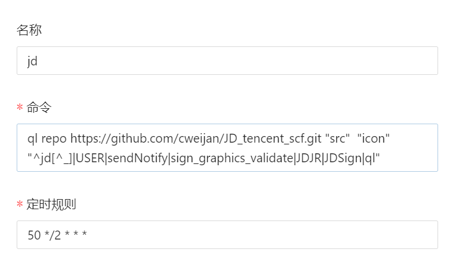
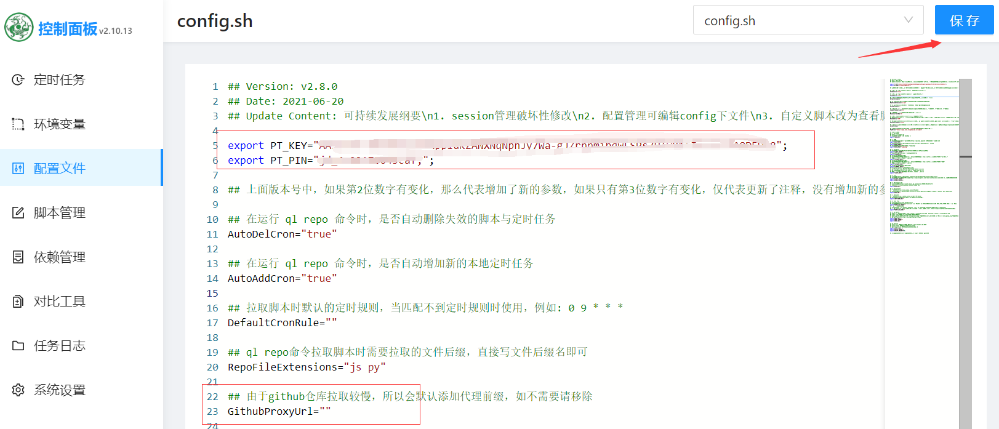
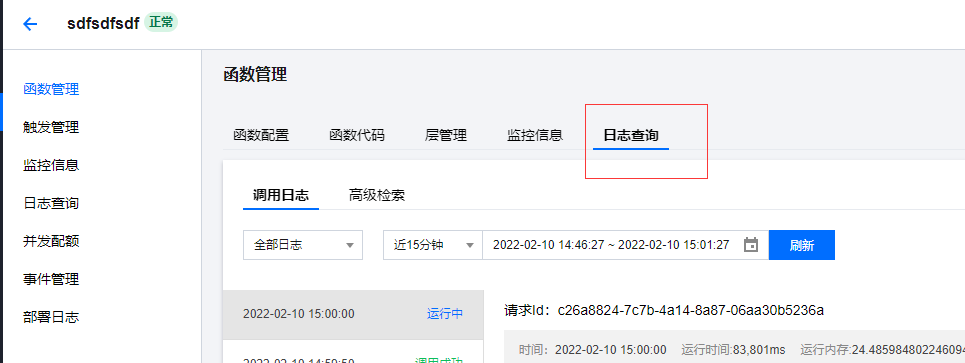
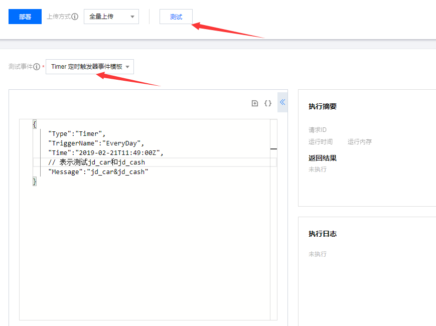
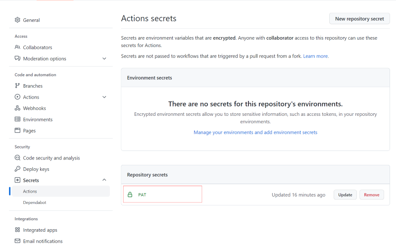

# 部署打京豆

## 简介

非脚本作者, 该仓库为打京豆的脚本部署流程, 每个月能打1500左右, [Docker部署](#Docker部署)方式, 每个月要更新一次cookie.

注意这个仓库基本只剩长期活动的脚本有效, 新活动的脚本需要去别的仓库找, 我是当成玩具挂着玩, 不打算更新脚本.

农场需激活: JD APP->免费水果->选择任一水果

## Docker部署

需要熟悉Docker的使用方式

1. 安装Docker
2. 安装青龙面板(用于定时执行脚本):

   1. 运行青龙面板Docker镜像: `docker run -dit -v $PWD/ql/config:/ql/config -v $PWD/ql/log:/ql/log -v $PWD/ql/db:/ql/db -p 5600:5600 --name qinglong --hostname qinglong --restart always whyour/qinglong:latest`
   2. 在浏览器访问127.0.0.1:5600, 按照提示完成初始化
3. 在青龙面板**右上角点击新建任务**, 配置:

   - 命令: ql repo https://github.com/cweijan/JD_tencent_scf.git "src"  "test|new|test_index" "^jd[^_]|USER|sendNotify|sign_graphics_validate|JDJR|JDSign|ql"
   - 定时规则: 50 0 0 * *
     
4. 配置青龙面板

   - 添加: export PT_KEY=""和export PT_PIN="", [获取方式点这里](./wiki/GetJdCookie.md)
   - 修改GithubProxyUrl为GithubProxyUrl=""
     
5. 回到定时任务面板, 点击任务的运行按钮, 就会拉取所有的脚本, 并定时执行这些脚本, 也可手动点击脚本旁边的按钮执行.

6. 多账号配置: 需要使用JD_COOKIE变量, 在配置文件中增加: export JD_COOKIE="pt_key=XXX;pt_pin=XXX;&pt_key=XXX;pt_pin=XXX;"

## 腾讯云函数部署

**已废弃**, 2022.6.1后腾讯云函数不再免费, 每个月需要最低收费12.8元, 不建议使用云函数方式部署了, 已使用云函数部署的建议立刻删掉.

### 开通云函数服务

1. 创建腾讯云账号, 依次进入 [SCF 云函数控制台](https://console.cloud.tencent.com/scf) 和 [SLS 控制台](https://console.cloud.tencent.com/sls) 开通相关服务.
2. 腾讯云日志服务不免费(很便宜), 余额为0建议往账户里面**充值1元**, 防止欠费被禁用.
3. **非必须, 没有再创建**: 不使用子账户, 保证有**SCF_QcsRole、SLS_QcsRole**权限的[服务角色](https://console.cloud.tencent.com/cam/role).

### 配置环境变量

创建github账号, **fork此仓库**或以此[仓库为模板创建](./wiki/importRepo.md), 仓库建立完成, 在**自己的仓库**内依次点击**settings->secrets->Actions**

通过点击**New repository secret**, 分别添加:

1. TENCENT_SECRET_ID: 进入[腾讯云密钥](https://console.cloud.tencent.com/cam/capi), 点击新建密钥后就会生成**SecretId**和**SecretKey**
2. TENCENT_SECRET_KEY
3. PT_KEY、PT_PIN: 登录后可从cookie中得到**PT_KEY**和**PT_PIN**, [获取方式](./wiki/GetJdCookie.md)
4. TENCENT_FUNCTION_NAME: 云函数名称, 任意值, 不填会有几率导致部署失败

### 部署

点击Actions->云函数部署, 先点击Enable WorkFlow启用, 再点击Run workflow, 等待运行完成, 没报错就是部署成功, 访问[腾讯云函数](https://console.cloud.tencent.com/scf/list), 即可查看最新部署的函数

有两种情况可能部署失败

1. 上传函数超时: 重新执行部署工作流直至成功
2. 未配置TENCENT_FUNCTION_NAME参数, 不配置会导致失败, 这是腾讯云的bug

多账户配置方式:

1. 通过[模板方式创建仓库](./wiki/importRepo.md)
2. 编辑自己仓库src/jdCookie.js中的CookieJDs变量(文件内有配置方式介绍), 生成一个新提交.

### 日志和执行

点击云函数, 可在**日志查询**面板查看定时执行的任务日志.

手动执行流程:

1. 点击云函数->函数代码->切换到旧版编辑器
2. 拉到编辑器下面, 可以看到测试输入框
3. 将message修改中的内容修改为脚本对应的名称, 测试多个脚本通过&符号连接, 输入**all**则执行全部.

### 自动同步代码

(非必须)自动同步你的仓库为该仓库的最新代码, 步骤:

1. [点此生成一个 token](https://github.com/settings/tokens/new) ，需勾选 `repo`和 `workflow`, 然后点击最下面的**Create Token**按钮。
2. 在仓库内**settings->secrets->Actions**中添加一个名为为**PAT**, 值为刚才创建的Token.
3. 进入Action中的同步仓库代码, 选中Enable WorkFlow, 然后就会定时执行同步Action了, 也可手动执行

## 消息推送

当cookie失效后或获得京豆时进行消息推送, 将对应推送的**Token**加到**环境变量**即可推送

- [推送加](http://www.pushplus.plus/): PUSH_PLUS_TOKEN
- [~~Server酱(不推荐)~~](https://sct.ftqq.com/sendkey): PUSH_KEY

## 特别声明

* 本仓库发布的Script项目中涉及的任何解锁和解密分析脚本，仅用于测试和学习研究，禁止用于商业用途，不能保证其合法性，准确性，完整性和有效性，请根据情况自行判断.
* 本项目内所有资源文件，禁止任何公众号、自媒体进行任何形式的转载、发布。
* lxk0301对任何脚本问题概不负责，包括但不限于由任何脚本错误导致的任何损失或损害.
* 间接使用脚本的任何用户，包括但不限于建立VPS或在某些行为违反国家/地区法律或相关法规的情况下进行传播, lxk0301 对于由此引起的任何隐私泄漏或其他后果概不负责.
* 请勿将Script项目的任何内容用于商业或非法目的，否则后果自负.
* 如果任何单位或个人认为该项目的脚本可能涉嫌侵犯其权利，则应及时通知并提供身份证明，所有权证明，我们将在收到认证文件后删除相关脚本.
* 任何以任何方式查看此项目的人或直接或间接使用该Script项目的任何脚本的使用者都应仔细阅读此声明。lxk0301 保留随时更改或补充此免责声明的权利。一旦使用并复制了任何相关脚本或Script项目的规则，则视为您已接受此免责声明.

 **您必须在下载后的24小时内从计算机或手机中完全删除以上内容.**  ` `

> ***您使用或者复制了本仓库且本人制作的任何脚本，则视为 `已接受`此声明，请仔细阅读***

## 特别感谢(排名不分先后)：

* [@NobyDa](https://github.com/NobyDa)
* [@chavyleung](https://github.com/chavyleung)
* [@liuxiaoyucc](https://github.com/liuxiaoyucc)
* [@Zero-S1](https://github.com/Zero-S1)
* [@uniqueque](https://github.com/uniqueque)
* [@nzw9314](https://github.com/nzw9314)
* [@JDHelloWorld](https://github.com/JDHelloWorld)
* [@smiek2221](https://github.com/smiek2221)
* [@star261](https://github.com/star261)
* [@Wenmoux](https://github.com/Wenmoux)
* [@Tsukasa007](https://github.com/Tsukasa007)
* [@Aaron](https://github.com/Aaron)
