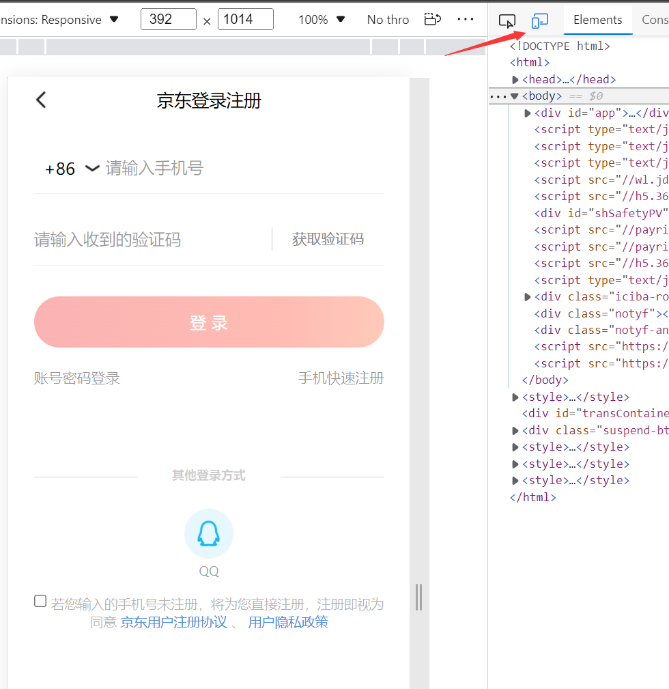

## 浏览器获取京东cookie教程

1. 电脑浏览器打开京东个人中心 [https://home.m.jd.com/myJd/home.action](https://home.m.jd.com/myJd/home.action)
2. 按键盘F12键打开开发者工具，然后点下图中的图标

3. 此时是未登录状态(使用手机短信验证码登录)，如已登录请忽略此步骤

   - 使用手机短信验证码登录(此方式cookie有效时长大概31天，其他登录方式比较短)
4. 登录后，依次选择Application->Cookies->https://home.m.jd.com/, 然后就可以看到pt_key和pt_pin了, 双击就可通过ctrl+c复制

