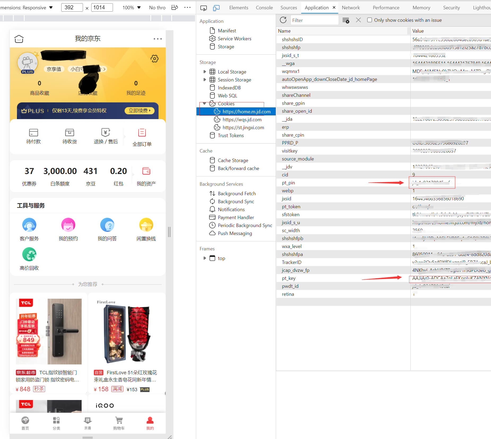

## 获取cookie

1. 浏览器打开个人中心进行登录 [https://home.m.jd.com/myJd/home.action](https://home.m.jd.com/myJd/home.action)
2. 登录后, 按下F12打开开发者工具，依次选择Application->Cookies->https://home.m.jd.com/, 然后就可以看到pt_key和pt_pin了, 双击就可通过ctrl+c复制
3. 其中pt_key具有有效期(手机验证码模式登录接近一个月, 其他方式有效期较短), pt_pin是用户标识, 获取后无需再改动.

