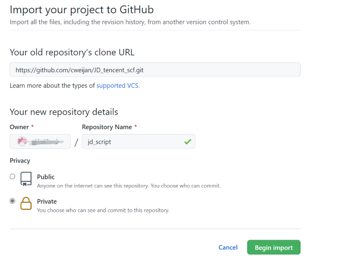

# 模板方式创建仓库

这种方式可以将仓库设置为私有, 可高效保护隐私, 强烈推荐.

1. 点击进入Github的[导入仓库页](https://github.com/new/import)
2. 在 `Your old repository’s clone URL`中填入https://github.com/cweijan/JD_tencent_scf.git
3. 随意设置仓库名, 并勾选为Private, 点击Begin Import开始导入, 等待约1分钟完成

4. 在仓库内点击settings->actions->Allow all actions->Save

